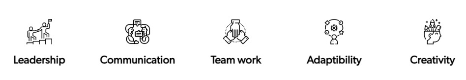

**<h3 align="center">This repository contains mostly asked TOP 60 HR Interview Questions</h3>**

<div align= "center"><h1>TOP 60 HR INTERVIEW QUESTIONS</h1></div> 

<h3 align="center">These TOP 60 HR Questions are the best selected question to help you enhance your skills, expand your knowledge and prepare for HR Interview from BASIC to ADVANCE.</h3>

&nbsp;&nbsp;&nbsp;&nbsp;&nbsp;&nbsp;&nbsp;&nbsp;&nbsp;&nbsp;&nbsp;&nbsp;&nbsp;&nbsp;&nbsp;&nbsp;&nbsp;&nbsp;&nbsp;&nbsp;&nbsp;&nbsp;&nbsp;&nbsp;&nbsp;&nbsp;&nbsp;&nbsp;&nbsp;&nbsp;&nbsp;&nbsp;&nbsp;&nbsp;&nbsp;&nbsp;&nbsp;&nbsp;&nbsp;&nbsp;&nbsp;&nbsp;&nbsp;&nbsp;&nbsp;&nbsp;&nbsp;&nbsp;&nbsp;
---
&nbsp;&nbsp;&nbsp;&nbsp;&nbsp;&nbsp;&nbsp;&nbsp;&nbsp;&nbsp;&nbsp;&nbsp;&nbsp;&nbsp;&nbsp;&nbsp;&nbsp;&nbsp;&nbsp;&nbsp;&nbsp;&nbsp;&nbsp;&nbsp;&nbsp;&nbsp;&nbsp;&nbsp;&nbsp;&nbsp;&nbsp;&nbsp;&nbsp;&nbsp;&nbsp;&nbsp;&nbsp;&nbsp;&nbsp;&nbsp;&nbsp;&nbsp;&nbsp;&nbsp;&nbsp;&nbsp;&nbsp;&nbsp;&nbsp;
## What are HR Interviews?

HR Interviews are mostly the final round of the recruitment process. This interview revolves around the candidate’s personality, behavior, ability to stay calm and more. On this page you will find the complete guide to cracking HR Interviews for all service based and product based companies, including questions asked in TCS HR Interview, Wipro HR Interview and more.

&nbsp;&nbsp;&nbsp;&nbsp;&nbsp;&nbsp;&nbsp;&nbsp;&nbsp;&nbsp;&nbsp;&nbsp;&nbsp;&nbsp;&nbsp;&nbsp;&nbsp;&nbsp;&nbsp;&nbsp;&nbsp;&nbsp;&nbsp;&nbsp;&nbsp;&nbsp;&nbsp;&nbsp;&nbsp;&nbsp;&nbsp;&nbsp;&nbsp;&nbsp;&nbsp;&nbsp;&nbsp;&nbsp;&nbsp;&nbsp;&nbsp;&nbsp;&nbsp;&nbsp;&nbsp;&nbsp;&nbsp;&nbsp;&nbsp;
<div align="center">
<h2>Why are HR Interviews conducted?</h2>

<p>HR Interviews are conducted to check whether a candidate posses the following qualities:-</p>

&nbsp;&nbsp;


# HR Interview Preparation - Important Points
</div>

<div>
<div align="left">HELLO</div><div align="right">Hello</div>
</div>

&nbsp;
## 🧑🏻About Us

&nbsp;
<div align= "center"> 

&nbsp;&nbsp;&nbsp;

My name is **YASH SHRIVASTAVA**. At present I am pursuing my degree in *Bachelor of Technology in Electronics and Communication Engineering* from *Lakshmi Narain College of Technology Excellence, Bhopal*. My current CGPA is 9.3. I have done my schooling Panini Jnanpeeth School (M.P.). I have excellent problem-solving skills and ability to perform well in a team. Passionate of coding and contribute for the best with my skills for my service. Work to Achieve the Highest Goal. [See Profile](https://www.linkedin.com/in/yashshrivastava92/)

</div>

## 👨‍🏫Contributing

&nbsp;
Contributions are always welcome!

See [```CONTRIBUTION.md```](CONTRIBUTION.md) for ways to get started.


## 📄License

LeetCode Solution is published to Github under the ***MIT*** license. See the [LICENSE](LICENSE.md) file for license rights and limitations.


## 👍Support

For support, or to join as contributor email shrivastavayash92@gmail.com

## ℹ️Feedback

If you have any feedback or suggestion, do fill the [Survey Form](https://forms.gle/1TUfnLPksdR12PLv5)

 
## Thanks to all the contributors ❤️
<a href = "https://github.com/yashshrivastavaa/TOP-100-Coding-Questions/graphs/contributors">
  
</a>

